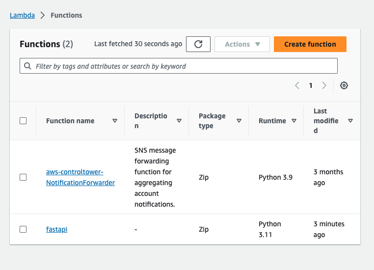
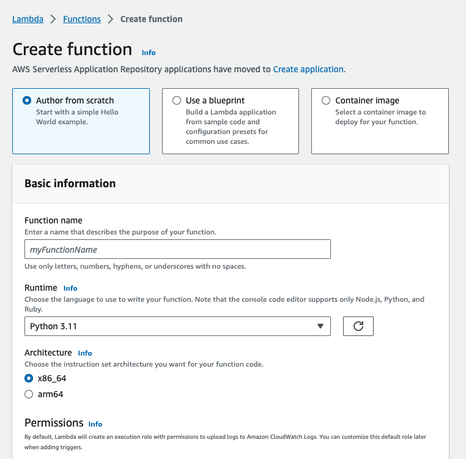
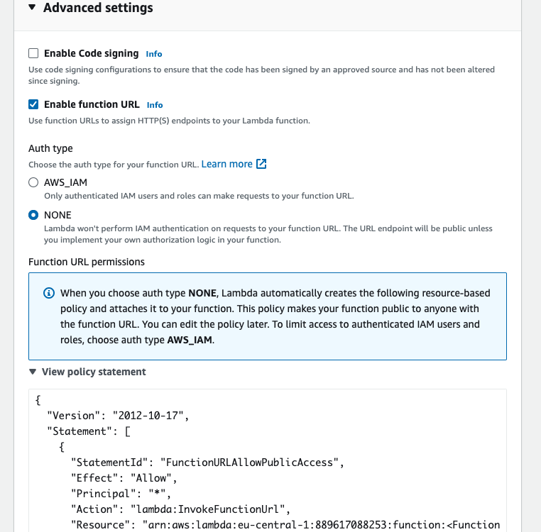
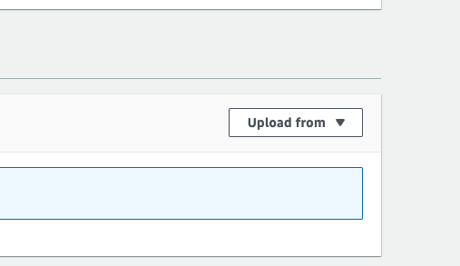

## Lambda mit FastAPI und Mangum

1. Virtual Enviroment

    Erstellt ein virtuelles Enviroment mit dem Namen "env"
    ```
    python -m venv env
    ```

    Virtuelles Enviroment aktivieren
    
    Linux

    ```
    source env/bin/activate
    ```
    Windows

    ```
    .\env\Scripts\Activate.ps1
    ```

    Je nach OS sind die Activate-Befehle unterschiedlich:
    https://docs.python.org/3/library/venv.html


2. Pakete installieren

    ```
    pip install fastapi==0.99.1 mangum==0.17.0
    ```

    Abhängigkeiten auflisten als requirements.txt

    ```
    pip freeze > requirements.txt
    ```

    Abhängigkeiten in einem seperaten "dependencies" Ordner installieren

    ```
    pip install -t dependencies -r requirements.txt
    ```

    ZIP File von dem Dependencies Ordner erstellen

    ```
    (cd dependencies; zip ../aws_lambda_artifact.zip -r .)
    ```

    Unseren Code dem ZIP hinzufügen (hier als Beispiel die main.py)

    ```
    zip aws_lambda_artifact.zip -u main.py
    ```

3. Lambda Funktion erstellen

    
    
    
    
    